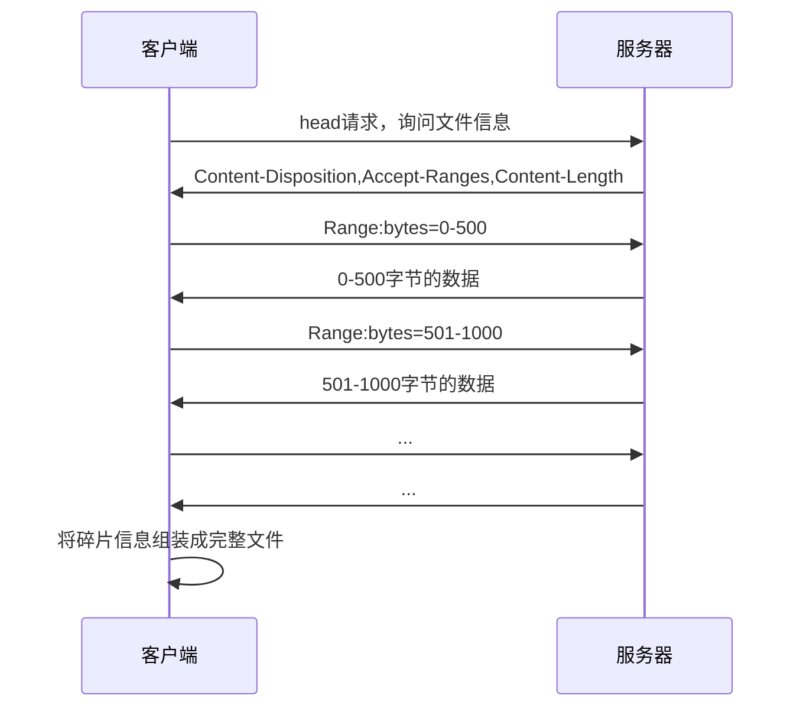
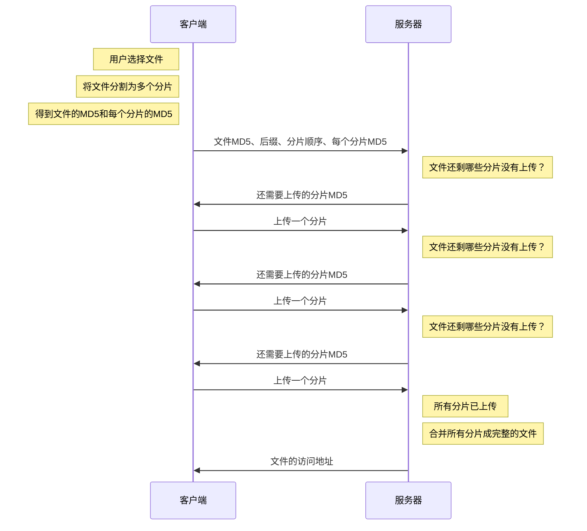

# 断点续传
<a :href="$withBase('/codes/断点续传.zip.pdf')" download>示例服务器代码</a>

## 下载

若要实现下载时的断点续传，首先，服务器在响应时，要在头中加入下面的字段

```
Accept-Ranges: bytes
```

这个字段是向客户端表明：我这个文件可以支持传输部分数据，你只需要告诉我你需要的是哪一部分的数据即可，单位是字节

此时，某些支持断点续传的客户端，比如迅雷，它就可以在请求时，告诉服务器需要的数据范围。具体做法是在请求头中加入下面的字段

```
Range: bytes=0-5000
```

客户端告诉服务器：请给我传递0-5000字节范围内的数据即可，无须传输全部数据

完整流程如下



----

*理解补充：*

1. 有的客户端同时请求，多个片段，加快速度，充分利用带宽。迅雷就是发送多个请求。
2. 实际没有这么短 500 ，一般直接1M，现在网速比较快
3. 总之，客户端的行为也会影响上面传送的逻辑。
4. 需要客户端和服务端共同来完成
5. `Range:bytes=0-500` 对应 `Accept-Ranges: bytes`，按字节划分的原因根据服务端的返回定的
6. 对于前端不需要管。除非浏览器插件，页面上实现断点下载是不行的，因为保存不了临时文件
7. 怎么完成断点下载呢？假设停电了，下次启动请求下载时，检验临时文件，跳过已下载文件。
8. 206 Partial Content 状态码表示当前结果是文件的部分

----


## 上传

整体来说，实现断点上传的主要思路就是把要上传的文件切分为多个小的数据块然后进行上传


虽然分片上传的整体思路一致，但它没有一个统一的、具体的标准，因此需要根据具体的业务场景制定自己的标准。

由于标准的不同，这也就意味着分片上传需要自行编写代码实现。

下面用一种极其简易的流程实现分片上传




----

*补充：*

1. md5
   - 不管文件大小，生成的 哈希值长度一致，
   - 哈希算法对文件改动非常敏感
   - 这里使用 md5 代表文件内容和编号

2. 第一步：这里的意思是请求后，服务端检查的几种情况

   - 上传过

     - 没传完

       没传完，检查哪个 md5 片段没传完，告诉客户端，客户端根据消息继续传。

     - 已传完

       检查后发现已存在，直接返回地址就ok。

   - 没上传过

     记录信息，告诉浏览器哪些 md5 片段没传完，客户端根据消息继续传

   > 个人理解：
   >
   > - 请求的整个文件的 md5 作用是服务器直接检查文件，是否传过
   >
   > - 分片的 md5 是用来检查 临时文件的。

3. 这里简单实现，有些问题没考虑：

   - 服务端

     - 分片乱序上传怎么处理

     - 迸发的时候，同时上传多个分片怎么处理

     - 多个用户同时上传不同的分片怎么处理

     - ...

   - 客户端

     - 一个一个上传可能很慢，那么直接一次性发送多个，利用多线程同时上传（work 中可以用ajax）

## 示例服务器

### 下载

http://localhost:8000/download/Wallpaper1.jpg

http://localhost:8000/download/Wallpaper2.jpg

http://localhost:8000/download/Wallpaper3.jpg

http://localhost:8000/download/Wallpaper4.jpg

http://localhost:8000/download/Wallpaper5.jpg

http://localhost:8000/download/Wallpaper6.jpg

http://localhost:8000/download/Wallpaper7.jpg

http://localhost:8000/download/Wallpaper8.jpg

http://localhost:8000/download/Wallpaper9.jpg

http://localhost:8000/download/Wallpaper10.jpg

### 上传

#### 文件信息协商

**请求路径**：/api/upload/handshake

**请求方法**：POST

**字段**：


| 字段名   | 含义                                      | 是否必须 |
| -------- | ----------------------------------------- | -------- |
| fileId   | 文件的MD5编码                             | 是       |
| ext      | 文件的后缀，例如：.jpg                    | 是       |
| chunkIds | 文件分片的编号数组，每个编号是一个MD5编码 | 是       |
|          |                                           |          |

**可能的响应**：

```js
{
  code: 0,
  msg: '',
  data: 'http://localhost:8000/upload/a32d18.jpg' // 服务器已有该文件，无须上传
}
```

```js
{
  code: 0,
  msg: '',
  data: ['md5-1', 'md5-2', 'md5-5'] // 服务器还需要上传的分片
}
```


**可能发生的失败响应**：

```js
{
	code: 403,
	msg: '请携带文件编号',
	data: null
}
```

#### 分片上传

**请求路径**：/api/upload

**请求方法**：POST

**字段**：

| 字段名  | 含义                  | 是否必须 |
| ------- | --------------------- | -------- |
| file    | 分片的二进制数据      | 是       |
| chunkId | 分片的MD5编码         | 是       |
| fileId  | 分片所属文件的MD5编码 | 是       |
|         |                       |          |

**上传成功的响应**：

```js
{
	code: 0,
  msg: '',
  data: ['md5-2', 'md5-5'] // 服务器还需要上传的分片
}
```

**可能发生的失败响应**：

```js
{
	code: 403,
	msg: '请携带文件编号',
	data: null
}
```

### 分片上传前端部分代码

```js
var domControls = {
  /**
   * 设置进度条区域
   * @param {number} percent 百分比 0-100
   */
  setProgress(percent) {
    const inner = $('.progress').show().find('.inner');
    inner[0].clientHeight; // force reflow
    inner.css('width', `${percent}%`);
    inner.find('span').text(`${percent}%`);
  },
  /**
   * 设置上传按钮状态
   */
  setStatus() {
    const btn = $('.btn.control');
    const status = btn[0].dataset.status;
    switch (status) {
      case 'unchoose': // 未选择文件
        btn.hide();
        break;
      case 'choose': // 刚刚选择了文件
        btn.show();
        btn.text('开始上传');
        break;
      case 'uploading': // 上传中
        btn.show();
        btn.text('暂停');
        break;
      case 'pause': // 暂停中
        btn.show();
        btn.text('继续');
        break;
      case 'finish': // 已完成
        btn.hide();
        break;
    }
  },
  /**
   * 设置文件链接
   */
  setLink(link) {
    $('#link').show().find('a').prop('href', link).text(link);
  },
};

/**
 * 文件分片
 * @param {File} file
 * @returns
 */
async function splitFile(file) {
  return new Promise((resolve) => {
    // 分片尺寸（1M）
    const chunkSize = 1024 * 1024;
    // 分片数量
    const chunkCount = Math.ceil(file.size / chunkSize);
    // 当前chunk的下标
    let chunkIndex = 0;
    // 使用ArrayBuffer完成文件MD5编码
    const spark = new SparkMD5.ArrayBuffer();
    const fileReader = new FileReader(); // 文件读取器
    const chunks = []; // 分片信息数组
    // 读取一个分片后的回调
    fileReader.onload = function (e) {
      spark.append(e.target.result); // 分片数据追加到MD5编码器中
      // 当前分片单独的MD5
      const chunkMD5 = SparkMD5.ArrayBuffer.hash(e.target.result) + chunkIndex;
      chunkIndex++;
      chunks.push({
        id: chunkMD5,
        content: new Blob([e.target.result]),
      });
      if (chunkIndex < chunkCount) {
        loadNext(); // 继续读取下一个分片
      } else {
        // 读取完成
        const fileId = spark.end();
        resolve({
          fileId,
          ext: extname(file.name),
          chunks,
        });
      }
    };
    // 读取下一个分片
    function loadNext() {
      const start = chunkIndex * chunkSize,
        end = start + chunkSize >= file.size ? file.size : start + chunkSize;

      fileReader.readAsArrayBuffer(file.slice(start, end));
    }

    /**
     * 获取文件的后缀名
     * @param {string} filename 文件完整名称
     */
    function extname(filename) {
      const i = filename.lastIndexOf('.');
      if (i < 0) {
        return '';
      }
      return filename.substr(i);
    }

    loadNext();
  });
}

// 选择文件
$('.btn.choose').click(function () {
  $('#file').click();
});
let fileInfo;
let needs;
function setProgress() {
  const total = fileInfo.chunks.length;
  let percent = ((total - needs.length) / total) * 100;
  percent = Math.ceil(percent);
  domControls.setProgress(percent);
}
$('#file').change(async function () {
  $('.modal').show();
  fileInfo = await splitFile(this.files[0]);
  const resp = await fetch('http://localhost:8000/api/upload/handshake', {
    method: 'POST',
    headers: {
      'content-type': 'application/json',
    },
    body: JSON.stringify({
      fileId: fileInfo.fileId,
      ext: fileInfo.ext,
      chunkIds: fileInfo.chunks.map((it) => it.id),
    }),
  }).then((resp) => resp.json());
  $('.modal').hide();
  if (Array.isArray(resp.data)) {
    needs = resp.data;
    setProgress();
    $('.btn.control')[0].dataset.status = 'choose';
    domControls.setStatus();
  } else {
    needs = [];
    setProgress();
    $('.btn.control')[0].dataset.status = 'finish';
    domControls.setStatus();
    domControls.setLink(resp.data);
  }
});

$('.btn.control').click(function () {
  const status = this.dataset.status;
  switch (status) {
    case 'unchoose':
    case 'finish':
      return;
    case 'uploading':
      this.dataset.status = 'pause';
      domControls.setStatus();
      break;
    case 'choose':
    case 'pause':
      this.dataset.status = 'uploading';
      uploadPiece();
      domControls.setStatus();
      break;
  }
});

async function uploadPiece() {
  if (!needs) {
    return;
  }
  if (needs.length === 0) {
    // 上传完成
    setProgress();
    $('.btn.control')[0].dataset.status = 'finish';
    domControls.setStatus();
    domControls.setLink(
      `http://localhost:8000/upload/${fileInfo.fileId}${fileInfo.ext}`
    );
    return;
  }
  const status = $('.btn.control')[0].dataset.status;
  if (status !== 'uploading') {
    return;
  }
  const nextChunkId = needs[0];
  const file = fileInfo.chunks.find((it) => it.id === nextChunkId).content;
  const formData = new FormData();
  formData.append('file', file);
  formData.append('chunkId', nextChunkId);
  formData.append('fileId', fileInfo.fileId);
  const resp = await fetch('http://localhost:8000/api/upload', {
    method: 'POST',
    body: formData,
  }).then((resp) => resp.json());
  needs = resp.data;
  setProgress();
  uploadPiece();
}

```

