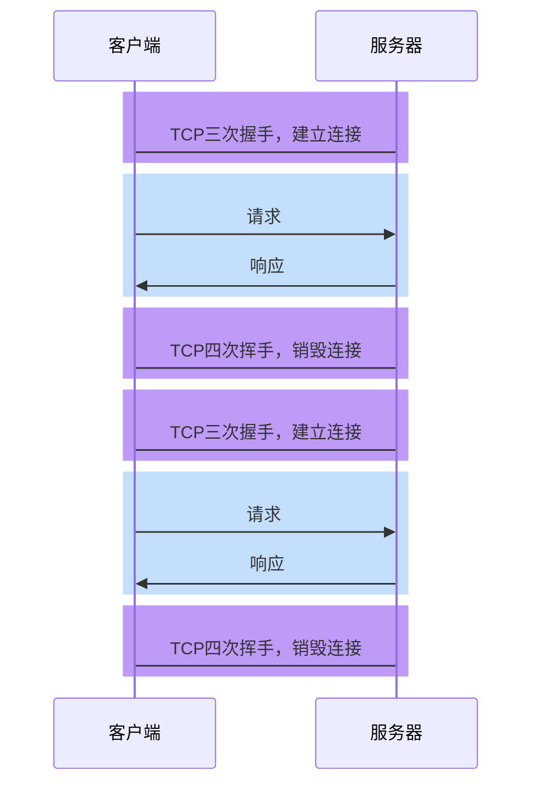
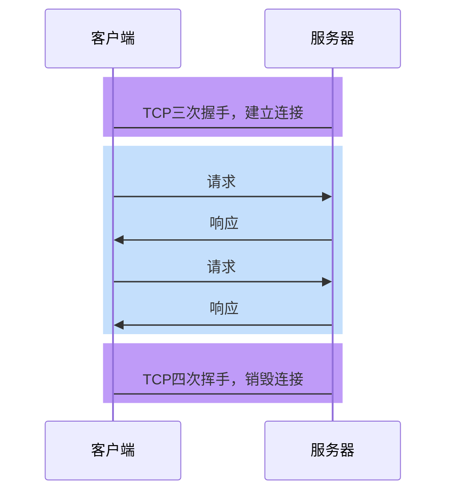

# HTTP各版本差异

http 的演化有 5 个版本：

1. http0.9 刚出来就被 pass 了

2. http1.0 好像 1996 年出来的，也就用了 1 年的时间，直到 http1.1 出世
3. http1.1 发布于1997年，http1.1 用的时间最长，现在仍然在用
4. http2.0  2015 年开始修订


## HTTP1.0

### 无法复用连接

HTTP1.0为每个请求单独新开一个TCP连接



由于每个请求都是独立的连接，因此会带来下面的问题：

1. 连接的建立和销毁都会占用服务器和客户端的资源，造成内存资源的浪费

2. 连接的建立和销毁都会消耗时间，造成响应时间的浪费

3. 无法充分利用带宽，造成带宽资源的浪费

   > TCP协议的特点是「慢启动」，即一开始传输的数据量少，一段时间之后达到传输的峰值。而上面这种做法，会导致大量的请求在TCP达到传输峰值前就被销毁了
   
   > *补充：*
   >
   > 对于第 3 点：tcp 还有一点 “拥塞控制”：tcp 刚建立连接传输很慢了，大概啥样子，用图描述，一开始很慢，然后指数增长，然后线性增长，得到了某个点发现网络拥塞了，就回一点，然后再线性增长，具体控制手段有很多种，这是其中一种。见下图。
   >
   > 
   >
   > 
   >
   > 很多情况下传输的数据刚建立连接，传输还没达到峰值，传输就结束了。比如在上图 *2-4* 阶段就结束，请求就断开了，下一次又重新连接。带宽就没能充分利用起来，即使带宽 1000M，发现还是很慢。

### 队头阻塞


> *不管有多少资源都要一个一个传，不能一起传。后期有非标做法改变这一现状，见下一章节 keep-alive*

## HTTP1.1

### 长连接

解决连接复用的问题

为了解决HTTP1.0的问题，**HTTP1.1默认开启长连接**，即让同一个TCP连接服务于多个请求-响应。（不需要设置 Connection:keep-alive，如果有表示兼容1.0 后期非标版本）



在这种情况下，多次请求响应可以共享同一个TCP连接，这不仅减少了TCP的握手和挥手时间，同时可以充分利用TCP「慢启动」的特点，有效的利用带宽。

> 实际上，在 HTTP1.0 后期，虽然没有官方标准，但开发者们慢慢形成了一个共识：
>
> **只要请求头中包含 Connection:keep-alive，就表示客户端希望开启长连接，希望服务器响应后不要关闭TCP连接。如果服务器认可这一行为，即可保持TCP连接。**

***什么时候关闭呢（了解下）？***

当需要的时候，任何一方都可以关闭TCP连接

> 扩展知识
>
> 连接关闭的情况主要有三种：
>
> 1. 客户端在某(最后)一次请求中设置了`Connection:close`，服务器收到此请求后，响应结束立即关闭TCP，*一直占线会浪费资源*。
>
> 2. 在没有请求时（*也就是两次请求之间*），客户端会不断对服务器进行心跳检测（一般每隔1秒）。一旦心跳检测停止，服务器立即关闭TCP
>
> 3. 当客户端长时间没有新的请求到达服务器，服务器会主动关闭TCP。运维人员可以设置该时间（keep-alive:time=5）。
>
>        Keep-Alive: timeout=5, max=100
>    
>    timeout：过期时间5秒，max是最多一百次请求，强制断掉连接

由于一个TCP连接可以承载多次请求响应，并在一段时间内不会断开，因此这种连接称之为长连接。

> *现象：*
>
> 调试工具中 Connection Id 如果一致，表示他们用的是同一个连接，如果使用 http1.0 每个 id 都不一样（如果开启 keep-alive，可能一样），使用 http1.1， 部分 id 就会一样，如果 http1.1 请求头中有 `Connection:keep-alive`，表示兼容处理，比较老的服务器能识别这个字段。

### 管道化和队头阻塞

HTTP1.1允许在响应到达之前发送下一个请求，这样可以大幅缩减带宽限制时间

**但这样做会存在队头阻塞的问题** *（缓解队头阻塞问题）*


-----

*补充：*

http1.1 仍然没有解决队头阻塞问题，之前一直是串行的，但是引入管道化做法，可以缓解这个问题，管道化啥意思呢？

例如：假设有两个请求，先发送一个请求，没等服务器响应就立即发送另一个请求，这样的话就能节省时间。

这样还存在问题，比如说：第一个请求资源比较大，或者需要加水印等耗时操作，而另一个请求服务器早就处理完了，这时需要等待，等待一个响应过去，才能响应。第二个资源就被第一个资源阻塞了，无意义的等待就是阻塞。这也是一种队头阻塞。

---

由于多个请求使用的是同一个 TCP 连接，**服务器必须按照请求到达的顺序进行响应**

> 想一想为什么？
>
> *因为服务端和端没有做处理，默认按照顺序来的，比如聊天，问题1,2,3，回答也是1,2,3，否则答非所问。*

于是，导致了一些后发出的请求，无法在处理完成后响应，产生了等待的时间，而这段时间的带宽可能是空闲的，这就造成了带宽的浪费

队头阻塞虽然**发生在服务器**，但这个问题的根源是客户端无法知晓服务器的响应是针对哪个请求的。

正是由于存在队头阻塞，我们常常使用下面的手段进行优化：

- 通过减少文件数量，从而减少队头阻塞的几率 （也就是雪碧图原理）

- 通过开辟多个TCP连接，实现真正的、有缺陷的并行传输

  > 浏览器会根据情况，为打开的页面自动开启TCP连接，对于同一个域名的连接最多6个 
  >
  > 如果要突破这个限制，就需要把资源放到不同的域中

**然而，管道化并非一个成功的模型，它带来的队头阻塞造成非常多的问题，所以现代浏览器默认是关闭这种模式的**

> *调试工具 waterflow（时序图） 中可以看到，同一个 connection Id 依然是一个个发送的，默认关闭的。*

### *为什么解决不了*

*因为 http 文档（报文）包括行、头、体（有时将行去掉，放到头里面），这是 http 传输的基本单元，请求响应都是这样格式。传的时候只能完整的分次传输过去，不能和另一个请求交叉传，否则就乱了。HTTP2.0 就是解决这个问题的。*

## HTTP2.0


*这里是四层网络模型，网络层、传输层、会话层、应用层。会话层是做安全的（具体见 SSL、TLS、HTTPS）。也就是说 http2.0 协议必须运行在安全模式之上。应用层加了个协议*

***Binary Framing 二进制分帧**。*

### 二进制分帧

HTTP2.0可以允许以更小的单元传输数据，每个传输单元称之为**帧**，而每一个请求或响应的完整数据称之为**流**，每个流有自己的编号，每个帧会记录所属的流。

*每一帧多少数据量不需要考虑*

比如，服务器连续接到了客户端的两个请求，一个请求JS、一个请求CSS，两个文件如下：

```js
function a(){}
function b(){}
```

```css
.container{}
.list{}
```

最终形成的帧可能如下


*例中 js 文件被拆成 3 帧，第一帧响应头，js header 包括里面状态码，缓存指令等等，那么这个就是这一帧的数据，我们称为 payload 载荷。左侧红色部分就是五层模型中每层传递时加个头就是那个头，头里带了 流 ID 和类型*

可以看出，每个帧都带了一个头部，记录了流的  ID，这样做就能够准确的知道这一帧数据是属于哪个流的。


> *这张图表示解决了队头阻塞问题。发送的请求谁先处理完，谁先响应，客户端根据流 ID 就能识别具体是哪个请求的数据。*


1. 这样就真正的解决了共享TCP连接时的队头阻塞问题，实现了真正的**多路复用**

> *多路复用：使用同一套连接，我们互不干扰的完成数据的传送。之前的 http1.1 实现了严重干扰的多路复用，见相应的图，第二次请求严重受到第一次干扰，我们认为没有实现的了。所以说 http2.0 实现了真正的多路复用，这是 http2.0 一个重要的特点，二进制分帧实现了多路服用。*


2. 不仅如此，由于传输时是以帧为单元传输的，无论是响应还是请求，都可以实现并发处理，即不同的传输可以交替进行。

> *这句话啥意思呢？用上图举例，假设请求 1，2 都处理完了，服务器可以一会响应1的响应数据，再响应2的响应数据，再响应1的响应数据。（之前思维误区纠正：服务端接收了完整的数据再处理，不是 tcp 的一次传输后就处理）*
>
> *利用迸发处理这一点，可以实现渐进式图片。*
>
> *渐进式图片：先给一张小图，先让看到一点点，然后慢慢的给张高清的图。有了 http2 技术的加持，可以这样做，假设小图、高清图数据用 1、2 表示，那么先按照1111,2222,1111,2222 这种顺序传递，达到的效果是，先展示了模糊部分的图片，然后模糊的部分清晰了，然后又呈现下一段模糊的部分，然后模糊又清晰了。这种一段段模糊到清晰的效果。*


3. 由于进行了分帧，还可以设置传输优先级。

   > *什么意思呢？2点*
   >
   > - *上上图的 js、css文件 请求例子距离，服务器响应 js 和 css，因为响应头里面有很重要信息，比如文件的类型(contentType)、文件长度等， 将响应头部的帧，设置优先级高，先将这 js 和 css 两个头部响应过去。（意思是：各自头部作为优先传，js 头、css 头 这两个片段优先级最高，先后传走，后面再交叉没问题，不是指 js 中可以设置后面的先传，一个流中需要保持顺序）*
   > - *甚至一个响应开始传输时，让另一个正在传输的响应停止传输。比如两个响应，一个是广告图片，还有一个是页面的 css ，广告图片正在传输，页面的 css 刚处理完，准备响应，因为页面 css 非常重要，设置了优先级，那么传输的广告图片的响应就得停止传输。等 css 传输完再传输。*

### 头部压缩

*因为 http 无状态每次请求，请求头都含有大量的字段，很多都一样，好比每次打电话都来段自我介绍，造成重复。这就是头部带来的负担。*

HTTP2.0 之前，所有的消息头都是以字符的形式完整传输的

可实际上，大部分头部信息都有很多的重复

为了解决这一问题，HTTP2.0 使用头部压缩来减少消息头的体积


---

*补充：*

*啥意思呢*：http2 使用表，**静态表**和**动态表**

1. 静态表：将常见的信息记录下来，进行编号，客户端和服务器各一份，好处，将来发送请求只要发送编号，服务器只要查静态表就知道具体内容，这样极大减少了传输的体积。

   *在 HTTP2 中，请求和响应标头字段的定义保持不变，仅有一些微小的差异：所有标头字段名称均为小写，请求行现在拆分成各个 `:method`、`:scheme`、`:authority` 和 `:path` 伪标头字段。[RFC 7540 - Hypertext Transfer Protocol Version 2 (HTTP/2) (ietf.org)](https://datatracker.ietf.org/doc/html/rfc7540)*

2. 动态表：也是两方都有，一开始都是空的，比如说 auth 字段，一开始检查静态表没有，再找动态表，都没有，然后就直接发给服务端，同时客户端记录到动态表中，服务端收到后发现动态表没有，也会插入。因为客户端认为发送的内容下次很可能继续被使用，例如cookie,token等，所以要存到动态表中，这样客户端和服务端动态表就能保持一致了，下一次再发送时，就直接用编号代替。

3. 通过这种方式大概能减少头部 20%-30% 的体积。

> 1. http2.0 没有请求行的概念了，在 rfc 7540 中没搜到 request-line 单词，前面的版本有。
>
> 2. http2.0 看到淘宝网等网站，请求行没有了，有的请求仍然大小写共存，估计是兼容性写法

----

对于两张表都没有的头部，则使用 **Huffman （哈夫曼压缩算法）**编码压缩后进行传输，同时添加到动态表中

> *意思是比如第一次请求，auth 字段两张表请求都没有，这时，传输时候将该字段的值（token=xxx）进行压缩，尤其是 cookie 值还比较多*

**总结：头部压缩技术两点内容：1. 静动态表 2. huffman 压缩** 


### 服务器推

HTTP2.0允许在客户端没有主动请求的情况下，服务器预先把资源推送给客户端

当客户端后续需要请求该资源时，则自动从之前推送的资源中寻找

> *啥意思呢：例如请求了一个网页，那么客户端需要读取网页内容才知道后面要请求的 css、js、img等资源，但是 http2.0 允许服务端直接推过来，认为客户端将来需要这些资源，类似 资源加载符 prefetch，甚至把别的网页也推给你，认为你将来可能要点击进入别的网页，将来需要用的时候发现已经有了资源就不需要再请求服务器了。*

### http2.0 问题

http2.0 刚出来就发现了问题，它解决不了 TCP 的队头阻塞，那就没法子了，它用的就是 tcp  协议。


例如：假设将第一帧交给 tcp 传输，没问题，然后第二帧交给 tcp 去传输，第三帧在等待。这时，第二帧由于网络原因丢失了，那么 tcp 他要解决传输可靠性，而且按顺序传输内容。由于第二帧丢失，tcp 就不敢传第三帧，只能重传第二帧，但实际上呢，第三帧可以传，因为他们属于不同的流，不影响，这就导致第三帧堵塞了，这就是 tcp 的堵塞。

## HTTP3.0

目前处于草案阶段。由于上述 http2.0 tcp 阻塞原因，修改 tcp 协议是不可能的，因为其他地方也会使用。于是 http3.0 抛弃 tcp 协议。使用 UDP 协议。

UDP 是一个简洁，没有可靠性的协议。那么可靠性怎么解决呢，http3.0 自己搞了个 QUIC （奎克）协议，该协议和 UDP 协议基本一样，将 tcp 队头阻塞问题解决了。把流编号直接放到 QUIC 协议里面去了。上面（http那层）就没有必要使用流编号了，所以搞了个 3.0，3.0 的优化是非常彻底的。（这意味着，2.0 的流编号在http层中）

### UDP

[一文搞懂TCP与UDP的区别 - 知乎 (zhihu.com)](https://zhuanlan.zhihu.com/p/60017840)

## 面试题

### 1. 介绍下 `http1.0`、`http1.1`、`http2.0` 协议的区别？

   > 参考答案：
   >
   > 首先说 http1.0
   >
   > 它的特点是每次请求和响应完毕后都会销毁 TCP 连接，同时规定前一个响应完成后才能发送下一个请求。这样做有两个问题：
   >
   > 1. 无法复用连接
   >
   >    每次请求都要创建新的 TCP 连接，完成三次握手和四次挥手，网络利用率低
   >
   > 2. 队头阻塞
   >
   >    如果前一个请求被某种原因阻塞了，会导致后续请求无法发送。
   >
   > 然后是 http1.1
   >
   > http1.1 是 http1.0 的改进版，它做出了以下改进：
   >
   > 1. 长连接
   >
   >    http1.1 允许在请求时增加请求头`connection:keep-alive`，这样便允许后续的客户端请求在一段时间内复用之前的 TCP 连接
   >
   > 2. 管道化
   >
   >    基于长连接的基础，管道化可以不等第一个请求响应继续发送后面的请求，但响应的顺序还是按照请求的顺序返回。
   >
   > 3. 缓存处理
   >
   >    新增响应头 cache-control，用于实现客户端缓存。
   >
   > 4. 断点传输
   >
   >    在上传/下载资源时，如果资源过大，将其分割为多个部分，分别上传/下载，如果遇到网络故障，可以从已经上传/下载好的地方继续请求，不用从头开始，提高效率
   >
   > 最后是 http2.0
   >
   > http2.0 进一步优化了传输效率，它主要有以下改进：
   >
   > 1. 二进制分帧
   >
   >    将传输的消息分为更小的二进制帧，每帧有自己的流的编号，即便被随意打乱也能在另一端正确组装(随意打乱：是指不同的流之间打乱可以，同一个流不行)
   >
   > 2. 多路复用
   >
   >    基于二进制分帧，在同一域名下所有访问都是从同一个 tcp 连接中走，并且不再有队头阻塞问题，也无须遵守响应顺序
   >
   > 3. 头部压缩
   >
   >    http2.0 通过字典的形式，将头部中的常见信息替换为更少的字符，极大的减少了头部的数据量，从而实现更小的传输量
   >
   > 4. 服务器推
   >
   >    http2.0 允许服务器直接推送消息给客户端，无须客户端明确的请求

### 2. 为什么 HTTP1.1 不能实现多路复用（腾讯）

   > 参考答案：
   >
   > HTTP/1.1 的传输单元是整个响应文本，因此接收方必须按序接收完所有的内容后才能接收下一个传输单元，否则就会造成混乱。而HTTP2.0的传输单元更小，是一个二进制帧，而且每个帧有针对所属流的编号，这样即便是不同的流交替传输，也可以很容易区分出每个帧是属于哪个流的。

### 3. 简单讲解一下 http2 的多路复用（网易）

   > 在 HTTP/2 中，有两个非常重要的概念，分别是帧（frame）和流（stream）。 帧代表着最小的数据单位，每个帧会标识出该帧属于哪个流，流也就是多个帧组成的数据流。 多路复用，就是在一个 TCP 连接中可以存在多条流。换句话说，也就是可以发送多个请求，对端可以通过帧中的标识知道属于哪个请求。通过这个技术，可以避免 HTTP 旧版本中的队头阻塞问题，极大的提高传输性能。

### 4. http1.1 是如何复用 tcp 连接的？（网易）

   > 客户端请求服务器时，通过请求行告诉服务器使用的协议是 http1.1，同时在请求头中附带`connection:keep-alive`（为保持兼容），告诉服务器这是一个长连接，后续请求可以重复使用这一次的 TCP 连接。
   >
   > 这样做的好处是减少了三次握手和四次挥手的次数，一定程度上提升了网络利用率。但由于 http1.1 不支持多路复用，响应顺序必须按照请求顺序抵达客户端，不能真正实现并行传输，因此在 http2.0 出现之前，实际项目中往往把静态资源，比如图片，分发到不同域名下的资源服务器，以便实现真正的并行传输。

### 5. http1.0、http2.0、http3.0 之间的区别

   > 参考答案：
   >
   > http1.0
   >
   > 每次请求和响应完毕后都会销毁 TCP 连接，同时规定前一个响应完成后才能发送下一个请求。这样做有两个问题：
   >
   > 1. 无法复用连接
   >
   >    每次请求都要创建新的 TCP 连接，完成三次握手和四次挥手，网络利用率低
   >
   > 2. 队头阻塞
   >
   >    如果前一个请求被某种原因阻塞了，会导致后续请求无法发送。
   >
   > http2.0
   >
   > http2.0 优化了传输效率，它主要有以下改进：
   >
   > 1. 二进制分帧
   >
   >    将传输的消息分为更小的二进制帧，每帧有自己的标识序号，即便被随意打乱也能在另一端正确组装
   >
   > 2. 多路复用
   >
   >    基于二进制分帧，在同一域名下所有访问都是从同一个 tcp 连接中走，并且不再有队头阻塞问题，也无须遵守响应顺序
   >
   > 3. 头部压缩
   >
   >    http2.0 通过字典的形式，将头部中的常见信息替换为更少的字符，极大的减少了头部的数据量，从而实现更小的传输量
   >
   > 4. 服务器推
   >
   >    http2.0 允许服务器直接推送消息给客户端，无须客户端明确的请求
   >
   > http3.0
   >
   > http3.0 目前还在草案阶段，它完全抛弃了 TCP 协议，转而使用 UDP 协议，是为了进一步提升性能。
   >
   > 虽然 http2.0 进行了大量的优化，但它无法摆脱 TCP 协议本身的问题，比如建立连接时间长、对头阻塞问题等等。
   >
   > 为了保证传输的可靠性，http3.0 使用了 QUIC 协议。
   >
   > [HTTP1.0、HTTP2.0、HTTP 3.0及HTTPS简要介绍_长不大的大灰狼的博客-CSDN博客](https://blog.csdn.net/glpghz/article/details/106063833)


